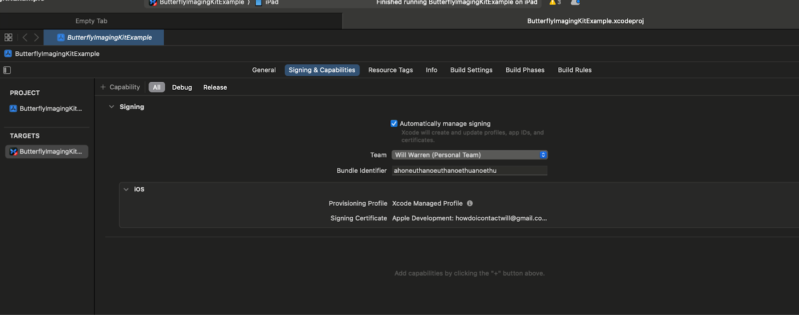
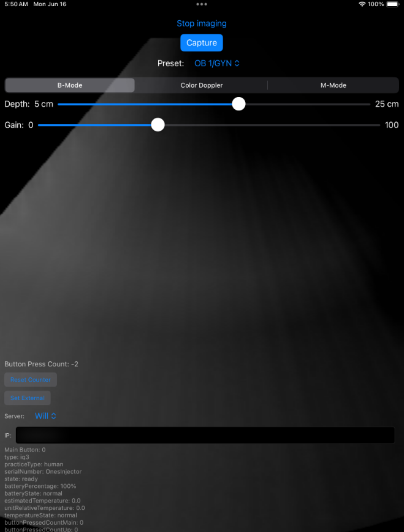

# IPad App

## Requirements

- MacOS: Minimum version: Sequoia, due to XCode requirement
- XCode: Minimum version: 16.3+
    - Install iPhone Simulator Package

## Running

- Open XCode and open a new project `./scripts/ipad_app/ButterflyImagingKitExample.xcodeproj`

- Set your Butterfly Client Key in the file `./scripts/ipad_app/ButterflyImagingKitExample/ButterflyImagingKitExampleApp.swift`

- Set a Bundle Identifier in Project -> General, it can be anything but it does neet to be set.

- Add yourself to the developer settings in your iPad/iPhone
    - Connect your iPad to the computer using a usb-c -> usb-c cable.
    - Launch the app in XCode by selecting this iPad in the run drop down.
    - The run will fail as this is the first time that you have launched.
    - Go to the iPad Settings -> VPN & Device Management and you should see the name of your app developer waiting to be approved.
    
    - From here out, you should be able to launch wirelessly which gives you access back to the usb-c port which you need to connect the ultrasound.

- Your running app should look like this:

## Notes

This app is preconfigured to use the muskuloskeletal preset, which is good for the test data set that we used, if you're using soft tissue you should switch this default to something more suitable.
The depth is defaulted to 7, and the down stream patch processing assumes this value.
There is a hardcoded IP addresses in the code for the location of the running Monty service where the images are sent.
- Monty Server - 192.168.1.140 - this can be changed / added to in `Model.swift`

# Usage

- Attach your Vive controller to the probe.
- Connect your probe the usb-c port.
- Launch the iPad app.  This depends on the following services:
    - A running Monty application.
    - A running Vive service.
    - A running visualization service.
- Set the probe home location by holding the probe underneath the phantom and pressing the top button.  You should see this change reflected in the visualization service.
- Click the probe center button twice, in order to get past as strange behavior in Monty that ignores the first 2 steps.
- Press the center button to take an image and send it to the Monty service.

# Starting a New Inference Session
- In the iPad app, there is a "Reset Counter" button, click this to return the counter to 0.
- Restart your Monty system.
- Continue as is Usage.