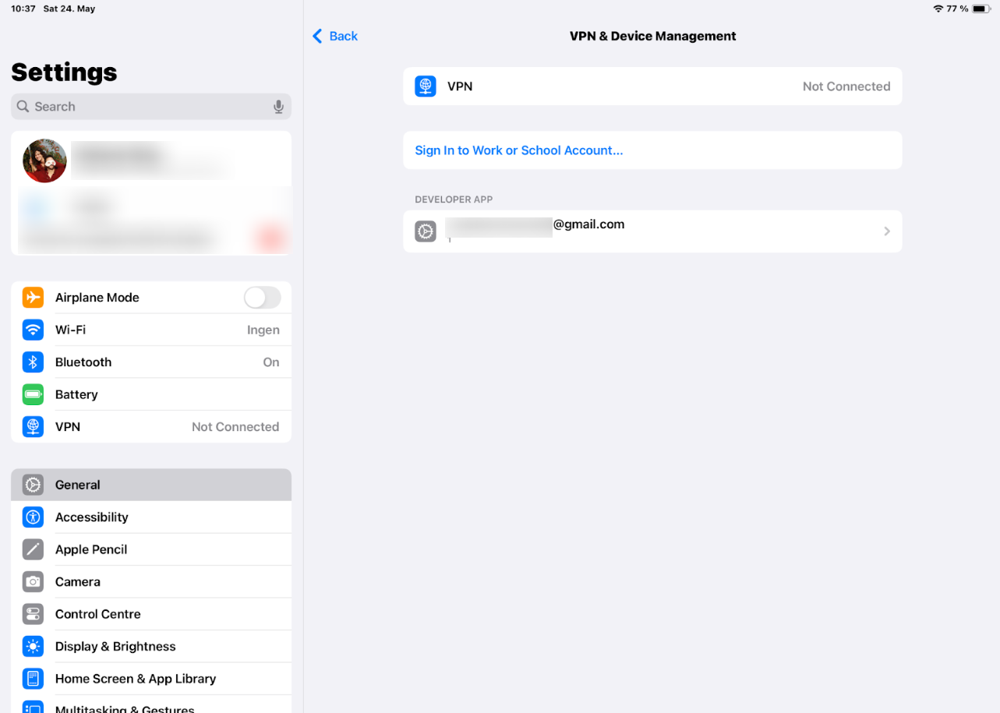

# IPad App

## Requirements

- MacOS: Minimum version: Sequoia, due to XCode requirement
- XCode: Minimum version: 16.3+
    - Install iPhone Simulator Package

## Running

- Begin by following the steps to [add your Butterfly Access Token](https://github.com/ButterflyNetwork/ImagingSDK-iOS/blob/main/Docs/AccessToken.md)

- Open XCode and open the project `./scripts/ipad_app/ButterflyImagingKitExample.xcodeproj`

- Set your Butterfly Client Key in the file `./scripts/ipad_app/ButterflyImagingKitExample/ButterflyImagingKitExampleApp.swift` (with quotation marks)

- Set a Bundle Identifier in Project -> General, it can be anything but it does neet to be set.

- If you run into any issues, see [Butterfly's README Guide](https://github.com/ButterflyNetwork/ImagingSDK-iOS?tab=readme-ov-file), including their [Troubleshooting Guide](https://github.com/ButterflyNetwork/ImagingSDK-iOS/blob/main/Docs/Troubleshoot.md)

- If you reveive the error message `ProbeDisabled-Reason.offlineTooLong`, try first connecting your Butterfly device to a smart device (iOS or Android) with the official Butterfly iQ app installed and setup. This should reset the probe, allowing you to reconnect it to the device with the custom Butterfly app running.

- Add yourself to the developer settings in your iPad/iPhone
    - Connect your iPad to the computer using a usb-c -> usb-c cable.
    - Launch the app in XCode by selecting this iPad in the run drop down.
    - The run will fail as this is the first time that you have launched.
    - Go to the iPad Settings -> VPN & Device Management and you should see the name of your app developer waiting to be approved.
    
    - From here out, you should be able to launch wirelessly which gives you access back to the usb-c port which you need to connect the ultrasound.

- Your running app should look like this:

## Notes

This app is preconfigured to use the muskuloskeletal preset, which is good for the test data set that we used, if you're using soft tissue you should switch this default to something more suitable.
The depth is defaulted to 7cm, and the down-stream patch processing assumes this value.
There is a hardcoded IP addresses in the code for the location of the running Monty service where the images are sent.
- Monty Server - 192.168.1.140 - this can be changed / added to in `Model.swift`. To find your IP address on your Mac, go to your Network settings, select `Details...` by the WiFi network you are connected to, and then `TCP/IP`. 
- Note that after updating the IP address in your Xcode app, you will need to resync it to the iPad (connect the iPad with USB-C and select Run) to ensure it is updated there.
- Alternatively, you can update the IP address directly when launching the iPad app (text box in bottom-left region).
